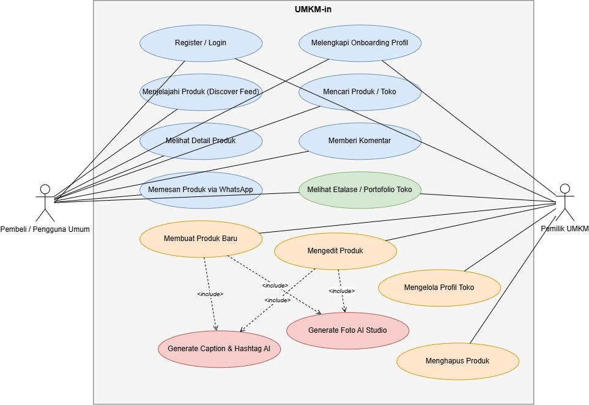
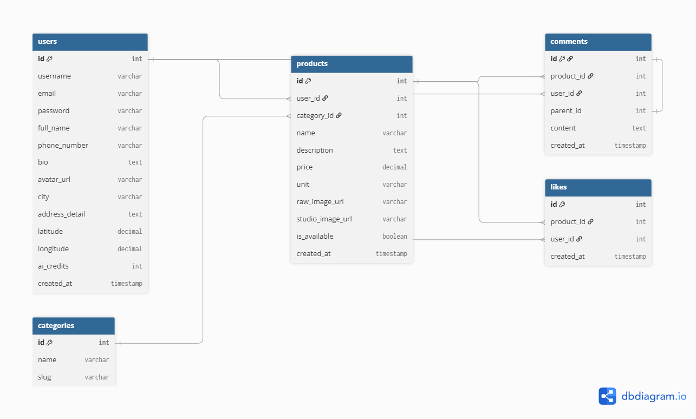
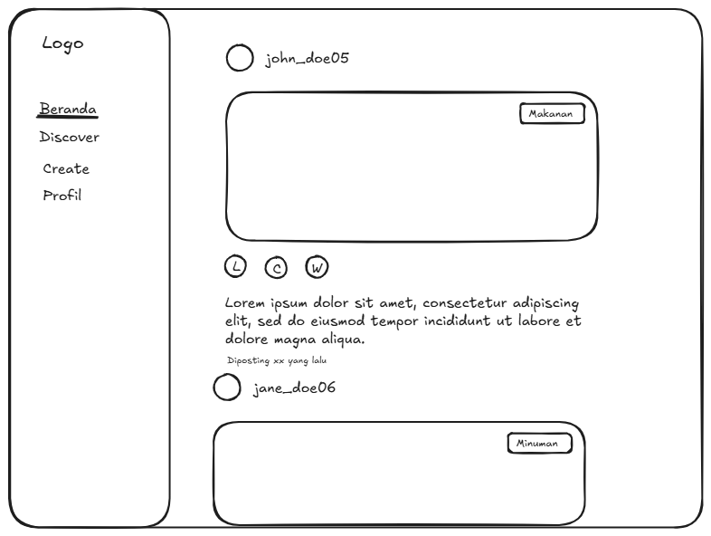
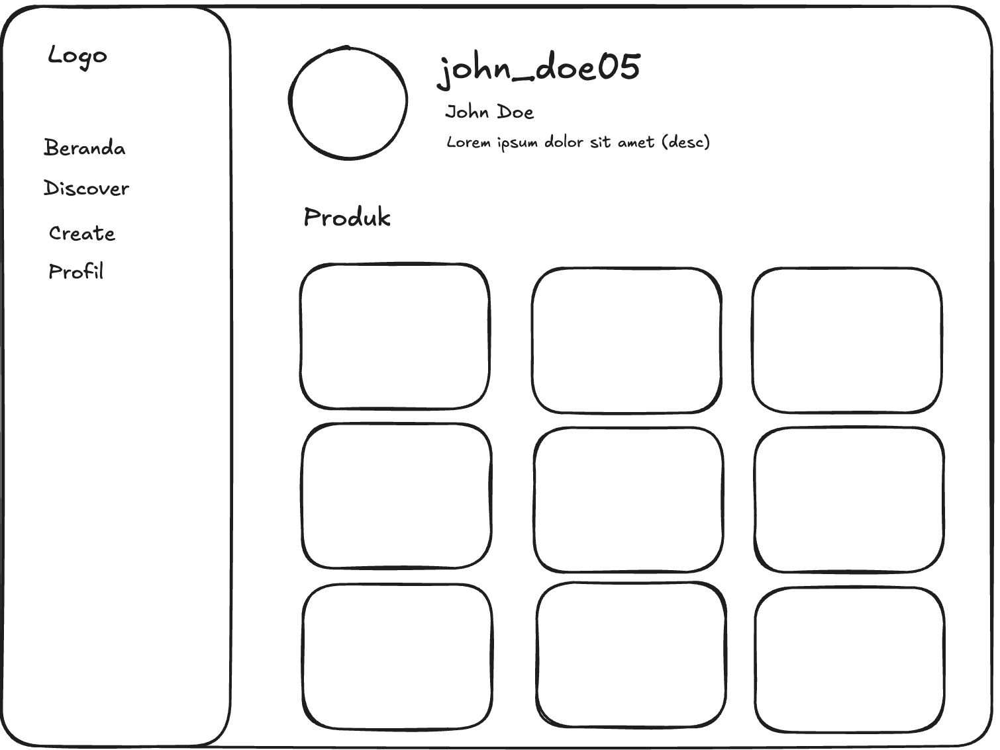
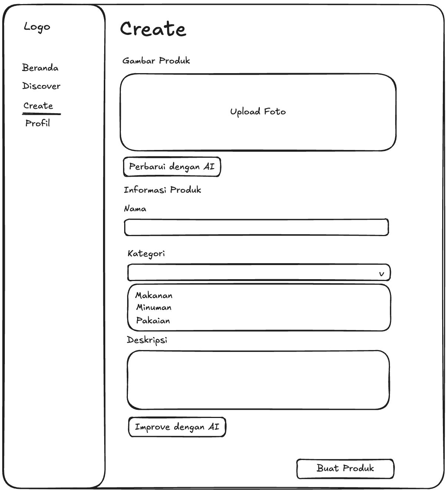
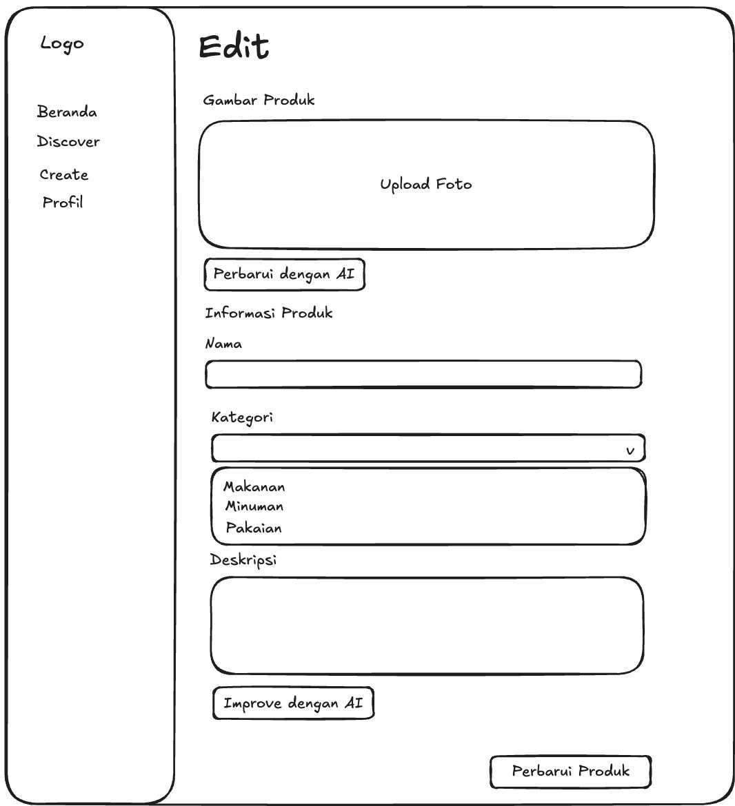
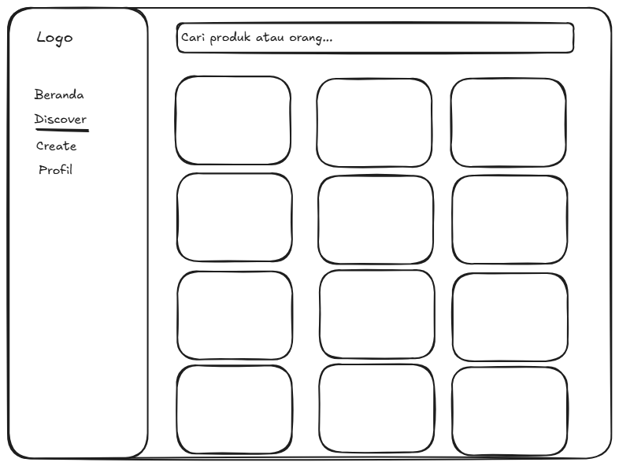
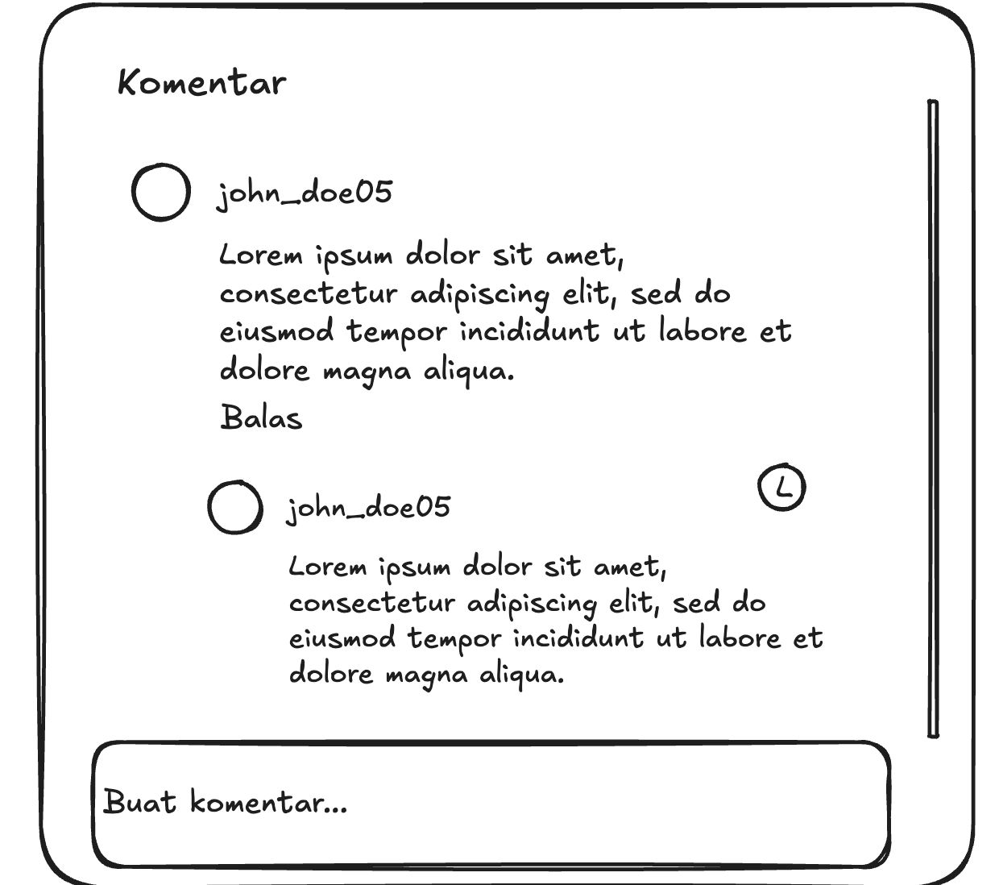

# Project Senior Project TI

Departemen Teknologi Elektro dan Teknologi Informasi, Fakultas Teknik, Universitas Gadjah Mada

---

## Identitas Kelompok

* **Nama Kelompok:** tim trio
* **Ketua Kelompok:** Aulia Nur Fajri Tri Anggoro (24/535054/TK/59327)
* **Anggota 1:** Josiah Hermes (24/543958/TK/60463)
* **Anggota 2:** Zahira Anindya Putri (24/543202/TK/60347)

---

## 1. Profil Produk

* **Nama Produk:** UMKM-in
* **Jenis Produk:** Social Commerce Feed dan In-App Generative AI Creative Studio Khusus Produk UMKM Lokal

---

## 2. Latar Belakang dan Permasalahan

### A. Paradoks Digitalisasi UMKM (Fenomena Mati Suri Onboarding)
Berdasarkan data survei Katadata Insight Center (KIC) dan Kementerian Koperasi dan UKM RI, sekitar 23,8 persen pelaku UMKM mengeluhkan rendahnya penjualan daring setelah melakukan pendaftaran pada platform e-commerce. Pada platform e-commerce raksasa, algoritma pencarian didominasi oleh toko resmi (Official Store) dan penjual bermodal besar yang mampu mengalokasikan dana iklan pencarian. Hal ini menyebabkan produk pedagang mikro tenggelam dan sulit ditemukan oleh calon pembeli terdekat.

### B. Kendala Komunikasi Visual dan Biaya Fotografi Komersial
Kualitas visual foto produk memegang peran krusial dalam membentuk kepercayaan pembeli online. Namun, sebagian besar pelaku UMKM mikro mengambil foto seadanya menggunakan kamera ponsel dengan latar belakang rumah yang kurang tertata serta pencahayaan minim. Jasa foto produk profesional di pasaran umumnya bertarif antara Rp 30.000 hingga Rp 100.000 per foto, nilai yang memberatkan bagi usaha mikro dengan margin laba kecil.

### C. Hambatan Operasional Multitasking Pedagang Mikro
Pelaku usaha mikro pada umumnya merangkap berbagai peran operasional sekaligus, mulai dari bagian produksi, pengemasan, administrasi pesanan, hingga pengiriman. Keterbatasan waktu dan minimnya keahlian desain grafis membuat pelaku UMKM kesulitan membuat materi promosi visual maupun menyusun kalimat copywriting yang menarik secara konsisten setiap hari.

---

## 3. Ide Solusi

UMKM-in hadir sebagai platform social-commerce terpadu yang memadukan penjelajahan produk lokal dengan otomasi pembuatan materi promosi berbasis Kecerdasan Buatan (Generative AI). Solusi utama yang ditawarkan meliputi:

1. **Hyperlocal Social Feed:** Linimasa publik berbasis kartu visual produk UMKM di sekitar pengguna yang dapat disaring berdasarkan kategori dan radius jarak terdekat.
2. **AI Background Isolator dan Generative Studio Inpainting:** Mesin pemrosesan gambar otomatis yang mampu menghapus latar belakang kotor dari foto ponsel mentah dan menggantinya dengan latar studio komersial yang bersih, estetik, dan proporsional tanpa biaya mahal.
3. **Multi-Tone AI Copywriter:** Generator teks promosi otomatis yang menghasilkan narasi produk persuasif, ringkasan keunggulan, serta tagar relevan yang disesuaikan dengan bahasa percakapan lokal.
4. **Direct-to-WhatsApp Instant Order:** Tombol pemesanan langsung dari kartu produk yang membuka aplikasi WhatsApp penjual dengan draf format pesanan rapi, meminimalkan friksi transaksi tanpa keharusan mengintegrasikan sistem gerbang pembayaran yang rumit bagi usaha mikro.

---

## 4. Analisis Kompetitor

Berikut adalah tabel komparasi fitur antara UMKM-in dengan beberapa platform sejenis di pasaran:

| Parameter Evaluasi | UMKM-in | Canva | PhotoRoom | Instagram Feed | Shopee / Tokopedia |
| :--- | :--- | :--- | :--- | :--- | :--- |
| **Model Platform** | Social Commerce dan AI Studio | Alat Desain Grafis | Editor Foto Produk AI | Media Sosial Publik | Marketplace E-Commerce |
| **Otomasi Studio Produk** | Otomatis 1 Klik | Manual (Drag and Drop) | Semi-Otomatis | Tidak Ada | Tidak Ada |
| **Generator Copywriting** | Tersedia (Bahasa Indonesia) | Tersedia (Bahasa Inggris) | Sangat Terbatas | Tidak Ada | Tidak Ada |
| **Katalog Produk Terdekat** | Tersedia (Radius Hyperlocal) | Tidak Ada | Tidak Ada | Berdasarkan Algoritma Iklan | Berdasarkan Algoritma Pencarian |
| **Akses Transaksi WhatsApp** | Terintegrasi Langsung | Tidak Ada | Tidak Ada | Manual via Link Bio | Terikat Sistem Internal Marketplace |
| **Struktur Biaya** | Akses Terbuka / Open Solution | Berlangganan / Freemium | Berlangganan USD Bulanan | Gratis (Iklan Berbayar) | Biaya Komisi dan Biaya Layanan |

### Evaluasi Rinci Kompetitor:

1. **Canva (Direct Competitor untuk Aspek Desain):**
   * *Kelebihan:* Ketersediaan ribuan template dan elemen visual yang sangat lengkap.
   * *Kekurangan:* Pengguna masih harus menyusun tata letak, memotong elemen, dan memikirkan teks promosi secara manual, sehingga memerlukan waktu dan keterampilan dasar desain.
   * *Keunggulan UMKM-in:* Cukup satu kali unggah foto mentah, sistem kecerdasan buatan langsung menghasilkan latar studio dan teks promosi siap pakai secara otomatis.

2. **PhotoRoom (Direct Competitor untuk Aspek AI Photography):**
   * *Kelebihan:* Ekstraksi objek dan penggantian latar belakang sangat bersih dan berkualitas tinggi.
   * *Kekurangan:* Biaya langganan berbasis mata uang asing (USD) yang relatif mahal untuk pedagang mikro, serta tidak memiliki fitur feed penjelajahan publik.
   * *Keunggulan UMKM-in:* Menggabungkan pengolahan visual, copywriting lokal, dan linimasa sosial khusus produk UMKM dalam satu platform.

3. **Shopee / Instagram (Indirect Competitor untuk Aspek Distribusi Produk):**
   * *Kelebihan:* Memiliki basis pengguna dan volume lalu lintas harian yang sangat besar di Indonesia.
   * *Kekurangan:* Pelaku usaha kecil sulit bersaing karena halaman utama didominasi toko beranggaran iklan besar, serta tidak menyediakan alat otomatis untuk peningkatan kualitas foto produk.
   * *Keunggulan UMKM-in:* Berfokus secara spesifik pada penemuan produk lokal terdekat dan menyediakan bantuan pembuatan konten visual bagi pedagang kecil agar mampu bersaing secara adil.

---

## 5. Metodologi SDLC

* **Metodologi yang Digunakan:** Scrum (Agile)
* **Alasan Pemilihan Metodologi:**  
  Pengembangan produk yang melibatkan integrasi Computer Vision dan Generative AI membutuhkan iterasi yang cepat dan adaptif. Agile memungkinkan tim (Backend, Frontend, dan AI Engineer) untuk mengembangkan dan menguji coba pipeline AI secara bertahap bersamaan dengan antarmuka web, serta memudahkan penyesuaian jika output gambar/teks dari model AI belum sesuai harapan.

---

## 6. Perancangan Pengembangan Produk (Tahap 1–3 SDLC)

### 6.1. Tujuan Produk
Membantu agar masyarakat semakin mengenal dengan UMKM yang ada di sekitarnya.

### 6.2. Pengguna Potensial dan Kebutuhannya
Pelaku UMKM mikro dan usaha rumahan, serta masyarakat lokal (konsumen) yang ada di dalam wilayah yang sama atau di luar wilayah.

### 6.3. Use Case Diagram
Berikut adalah diagram use case yang menggambarkan interaksi antara Pembeli/Pengguna Umum dan Pemilik UMKM terhadap sistem UMKM-in:

### 6.4. Functional Requirements (FR)
Berikut adalah daftar kebutuhan fungsional yang dirancang untuk mendukung use case sistem:

| Kode FR | Deskripsi Kebutuhan Fungsional |
| :--- | :--- |
| **FR 1** | Sistem dapat melakukan pemrosesan foto otomatis (AI Background Remover & Inpainting) untuk menghapus latar belakang yang berantakan dari unggahan pengguna. |
| **FR 2** | Sistem dapat mengganti latar belakang foto produk menjadi latar studio estetik dan menambahkan bayangan yang realistis. |
| **FR 3** | Sistem memiliki generator Smart Copywriting untuk membuat deskripsi produk, kalimat promosi persuasif, dan tagar secara otomatis menggunakan model bahasa. |
| **FR 4** | Sistem menyediakan linimasa penjelajahan produk UMKM lokal (Hyperlocal Discovery) yang diurutkan berdasarkan lokasi terdekat dari konsumen. |
| **FR 5** | Sistem menyediakan tombol Direct-to-WhatsApp Order di setiap postingan yang secara otomatis membuka obrolan lengkap dengan draf pesanan. |

### 6.5. Entity Relationship Diagram (ERD)
Rancangan skema basis data relasional untuk sistem UMKM-in:

### 6.6. Low-Fidelity Wireframe
Rancangan antarmuka pengguna (UI) tingkat rendah (Lo-Fi) untuk alur kerja aplikasi web UMKM-in:

#### A. Beranda (Social Feed)
Tampilan linimasa publik berbasis kartu produk lokal terdekat dengan aksi Like, Comment, dan WhatsApp Order.

#### B. Discover (Pencarian & Eksplorasi)
Halaman penjelajahan dan pencarian produk maupun toko UMKM.

#### C. Pembuatan Produk Baru (Create)
Form pembuatan produk dengan tombol integrasi AI Studio ("Perbarui dengan AI") dan Smart Copywriter ("Improve dengan AI").

#### D. Edit & Manajemen Produk
Halaman pengeditan informasi produk serta opsi menu tindakan produk.

#### E. Profil Toko
Halaman portofolio toko dan etalase produk UMKM.

#### F. Interaksi Komentar
Modal diskusi komentar antar pengguna yang mendukung balasan bertingkat (*reply*).

---

## 7. Gantt-Chart Pengerjaan Proyek (1 Semester)

Rencana jadwal pengerjaan proyek selama 1 semester (12 pertemuan):

| Kegiatan | Pertemuan 1–2 | Pertemuan 3–4 | Pertemuan 5–6 | Pertemuan 7–8 | Pertemuan 9–10 | Pertemuan 11–12 |
| :--- | :---: | :---: | :---: | :---: | :---: | :---: |
| **Brainstorming & Research** | ✅ | | | | | |
| **UI/UX Design & Architecture** | | ✅ | | | | |
| **Developing (Frontend, Backend, AI)** | | | ✅ | ✅ | | |
| **Testing & Integration** | | | | | ✅ | |
| **Revision & Presentation** | | | | | | ✅ |
